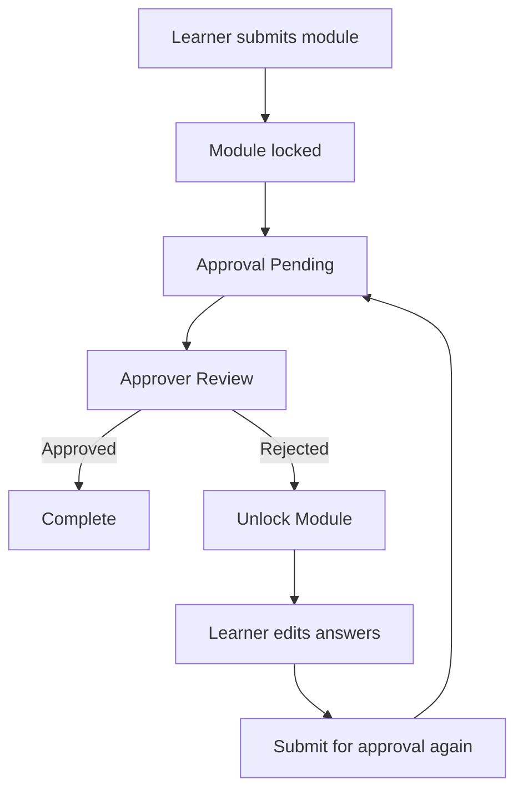
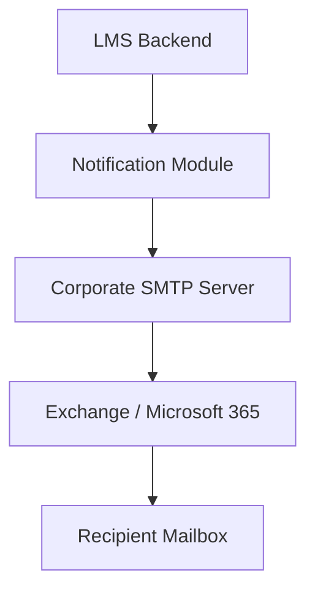

# Notification Module

## Purpose

The Notification Module sends email notifications triggered by system events. It centralizes all email-related logic so other modules do not interact directly with the SMTP server or email provider.

The Approval Module, and any future modules, requests a notification to be sent. The Notification Module then determines the appropriate recipient, email template, and delivery mechanism.

## Related Database Tables

- `approval_request`
- `user_exam_attempt`
- `module_master`

## Approval Notifications

### Current Notification Events

#### 1. Approval Request Created

**Trigger**

Occurs after a learner submits a module that requires approval.

**Recipient**

Assigned approver: `approval_request.assigned_to -> user_master.email`

**Purpose**

Notify the approver that a new submission requires review.

**Example subject**

```text
Module Approval Required - <Module Name>
```

#### 2. Approval Approved

**Trigger**

Occurs when an approver approves the submission.

**Recipient**

Learner: `user_exam_attempt.user_id -> user_master.email`

**Purpose**

Notify the learner that the module has been successfully approved.

**Example subject**

```text
Congratulations! Your <Module Name> has been approved.
```

#### 3. Approval Rejected

**Trigger**

Occurs when an approver rejects the submission.

**Recipient**

Learner: `user_exam_attempt.user_id -> user_master.email`

**Purpose**

Notify the learner that the submission has been rejected and include the approver's remarks.

**Example subject**

```text
Your <Module Name> submission has been rejected.
```

**Example body**

```text
Reason:
<Approval Remarks>

Please review your answers and resubmit the module.
```

## Module State Flow



The Notification Module is invoked each time the workflow transitions into one of the notification events.

## Email Delivery

The LMS does not send emails directly to recipients. Instead, it sends email requests to the corporate SMTP server.



The SMTP server is responsible for routing and delivering emails to the appropriate mail server.
